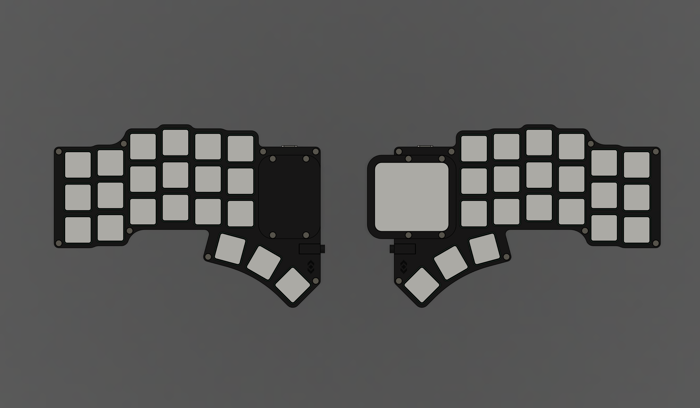
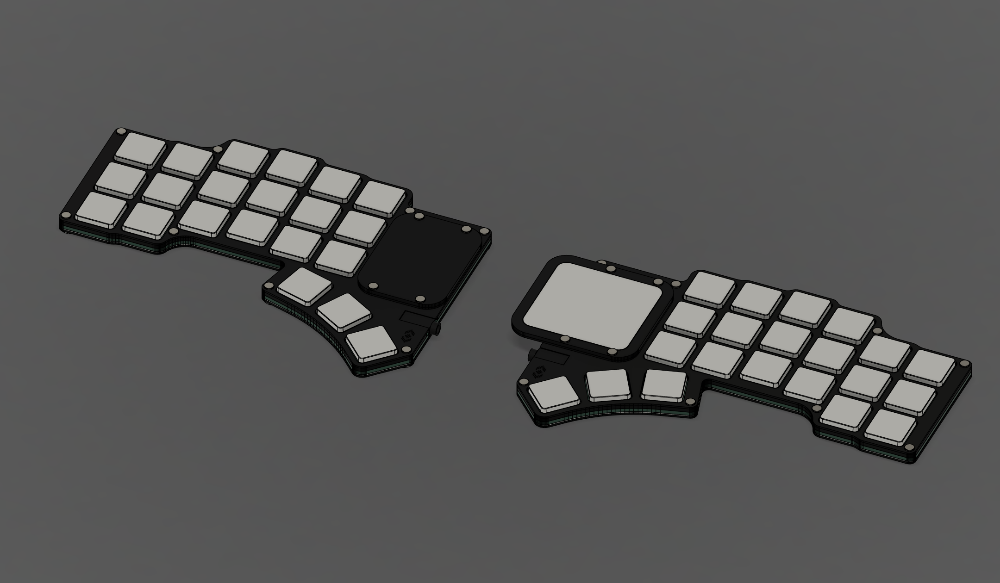
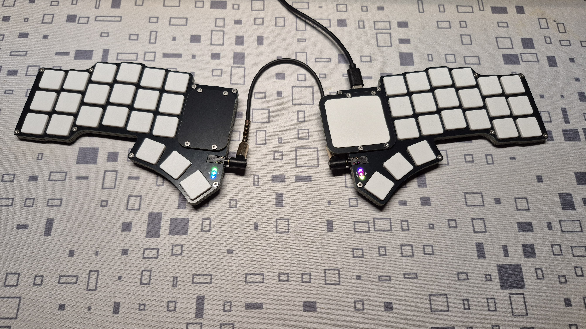
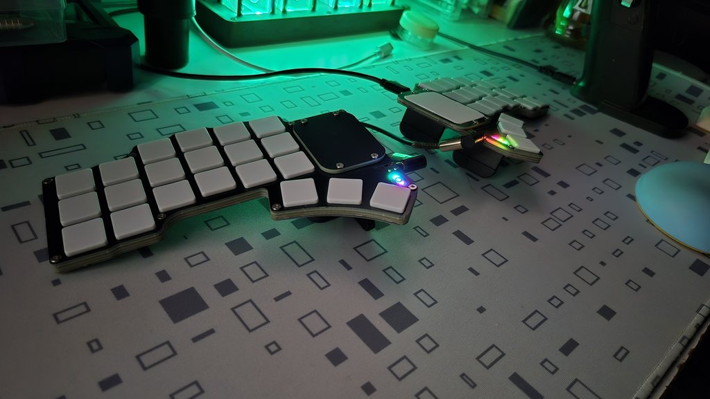
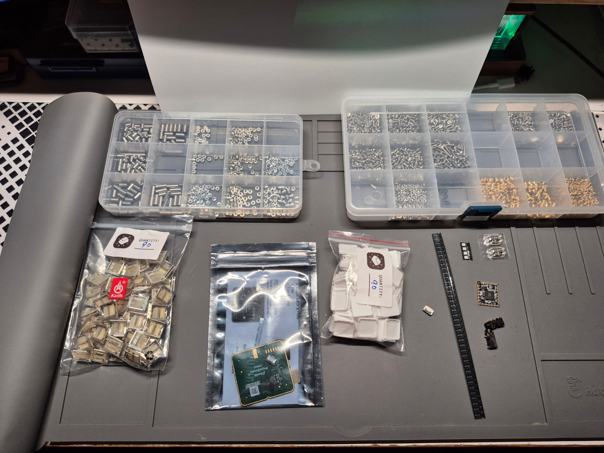
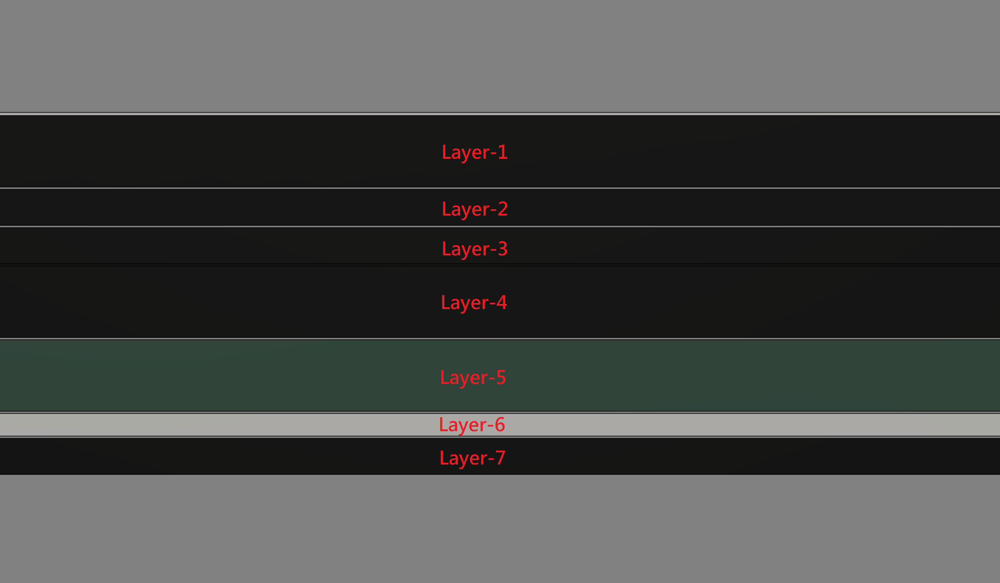
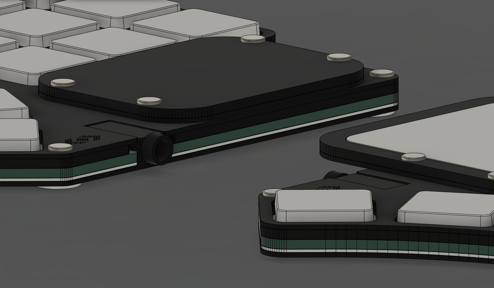
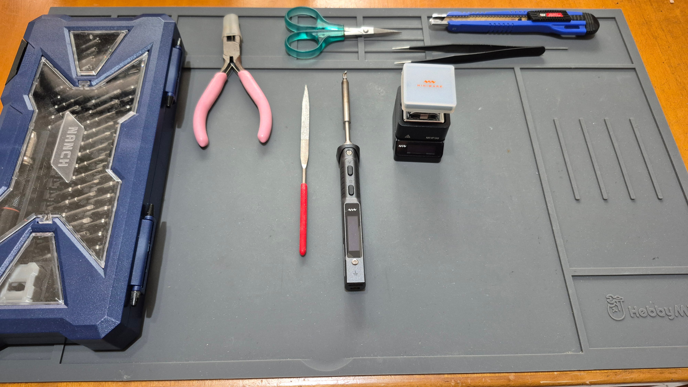

# Paicorea43-1

|||
|--|--|
|||

## 說明

Paicorea是一把專門為我而設計的分離式機械鍵盤，目的是為了讓鍵盤可以達到極度輕薄，又可以搭載`TPS43`這張由`Azoteq`公司生產製造的觸控板，滿足我的日常生活而使用。

它可以根據自己的需求選擇是否觸控板作為滑鼠使用；鍵盤按鍵則是使用`Kailh`生產製造的`PG1316S`作為它「目前」的按鍵使用，往後不排除會設計另一種機械鍵軸的版本來給自己做使用。

鍵盤的最初設計是像[AZCARD](https://github.com/palette-system/azcard)、[Bayleaf](https://kbd.news/Bayleaf-2610.html)、[Makefive](https://github.com/mikeholscher/zmk-config-mikefive)等一樣搭載`PG1316S`鍵軸的鍵盤都是以本體PCB作為底板壓縮厚度到3mm左右，但因為本人——也就是我自己，非常不喜歡使用無線設備（電池安全問題）的原因，一定得在鍵盤上搭載分離式鍵盤常見的`3.5mm TRRS座`，而我在這部分花了很多時間尋找能使用的零件，最後找到`PJ-381B`、`PJ-381C`、`PJ-399`等3款可以使用的沉板型號，再根據Datasheet跟3D設計，選擇了`PJ-381B`來使用。

在不想向下更換`2.5mm TRRS座`的前提下，很可惜地我只能將鍵盤厚度壓縮至5.5mm左右，但整體的結構讓我相當滿意。

使用`RP2040 Core-A`的原因——它跟用排線分離設計的`RP2040-Tiny`不同，我可以直接在PCB上拉USB2.0使用的USB-C口接線接在`RP2040 Core-A`上達到分離MCU跟USB-C的目的，而不用而外設計一個專門放置排線跟分離板的位置，而且又是厚度只有5.5mm的空間內。

最終從MCU——RP2040 Core-A（Raspberry Pi）中取Pi（π，Pai同音）、Core-A（corea）、TPS43及按鍵數量42鍵作為命名使用（43-1），Paicorea43-1就這麼出來了。

## 使用材料

|名稱|規格|數量|備註|
|--|--|--|--|
|MCU|RP2040 Core-A|2|-|
|Type-C母座|TYPE-C 16P CB1.6|2|沉板1.6mm|
|TRRS母座|PJ-381B|2|-|
|二極體|1N4148 SOD-123|42|-|
|鍵軸|Kailh PG1316S|42|-|
|鍵帽|適用PG1316S、`1u`大小|42|推薦用買的，3D列印需`留意邊角`圓弧|
|貼片銅柱|MAC8 TH0.8-2.0-M2（2.0）|8|-|
|貼片銅柱|MAC8 TH1.6-2.0-M2（2.0）|4|-|
|M2螺絲|牙長5mm、頭部`小於`ø4.2mm|12|-|
|矽膠自黏腳貼|ø8mm、厚度0.5-1.0mm|-|根據自己所需決定數量|
|矽膠墊|厚度0.3-0.5mm|-|需要裁切大小，請自行判斷需要多大面積|
|PVC板材|厚度0.5-0.8mm|-|觸控板面用，`A4`大小即可，需要裁切|
|0.5mm FFC排線座|6Pin|1|選配，安裝觸控板才需要|
|0.5mm FFC軟排線|6Pin、50mm、`AA同向`|1|選配，安裝觸控板才需要|
|觸控板|Azoteq TPS43-201A-S|1|選配|
|貼片LED燈|SK6805-2427（Micro）|4|選配，裝飾燈|

## 鍵盤結構

|||
|--|--|

|順序|部件|厚度|備註|
|--|--|--|--|
|1|上蓋-A（Cover-A）、觸控板邊框-A（Track-A）|1.6mm|有無觸控板做選擇|
|2|上蓋-B（Cover-B）、觸控板邊框-B（Track-B）|0.8mm|有無觸控板做選擇|
|3|定位板（Plate）|0.8mm|-|
|4|間隙空間板（Body）|1.6mm|-|
|5|核心電路板（Main）|1.6mm|-|
|6|矽膠墊（Silicone Pad）|0.3-0.5mm|自行裁切即可|
|7|底板（Bottom）|0.8mm|-|

## 使用工具

||名稱|使用場合|備註|
|--|--|--|--|
|1|電烙鐵|基本電路板焊接||
|2|熱風槍或加熱台|進階電路板焊接|擇一使用即可|
|3|剪刀及美工刀|裁切膠帶及塑料板材||
|4|超薄超黏雙面膠|粘貼固定觸控板用||
|5|對應電路板顏色的簽字筆|邊框填色使用|可不需使用|
|6|防靜電金屬鑷子|進階電路板焊接、測試、精密操作||
|7|精密螺絲起子|-|對應螺絲規格使用|

## 參考資料