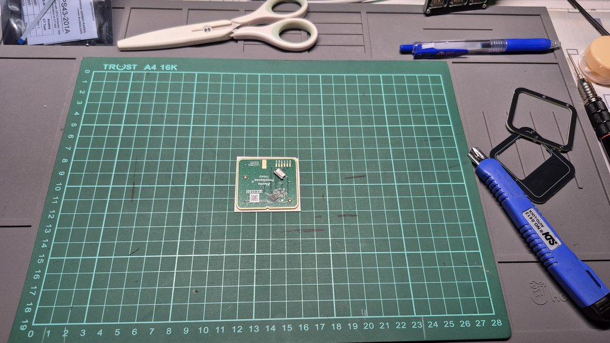
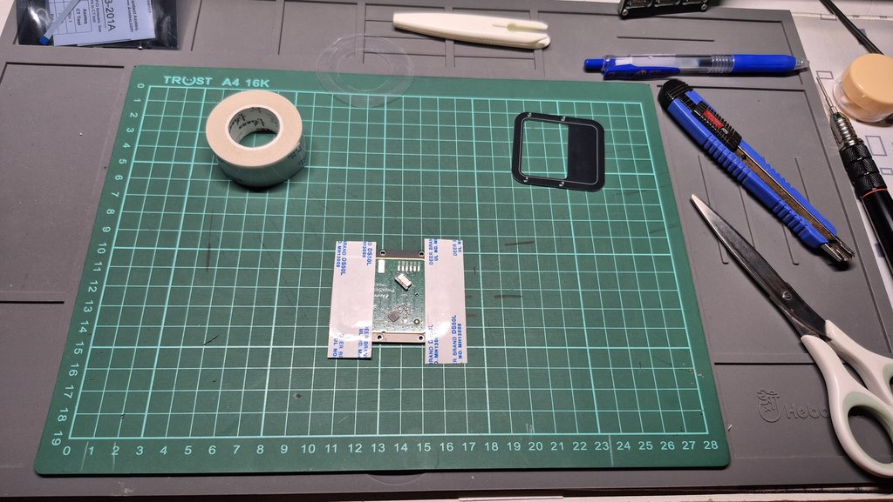

# Paicorea

|||
|--|--|
|||

## 說明

Paicorea是一把專門為我而設計的分離式機械鍵盤，目的是為了讓鍵盤可以達到極度輕薄，又可以搭載`TPS43`這張由`Azoteq`公司生產製造的觸控板，滿足我的日常生活而使用。

它可以根據自己的需求選擇是否觸控板作為滑鼠使用；鍵盤按鍵則是使用`Kailh`生產製造的`PG1316S`作為它「目前」的按鍵使用，往後不排除會設計另一種機械鍵軸的版本來給自己做使用。

鍵盤的最初設計是像[AZCARD](https://github.com/palette-system/azcard)、[Bayleaf](https://kbd.news/Bayleaf-2610.html)、[Makefive](https://github.com/mikeholscher/zmk-config-mikefive)等一樣搭載`PG1316S`鍵軸的鍵盤都是以本體PCB作為底板壓縮厚度到3mm左右，但因為本人——也就是我自己，非常不喜歡使用無線設備（電池安全問題）的原因，一定得在鍵盤上搭載分離式鍵盤常見的`3.5mm TRRS座`，而我在這部分花了很多時間尋找能使用的零件，最後找到`PJ-381B`、`PJ-381C`、`PJ-399`等3款可以使用的沉板型號，再根據Datasheet跟3D設計，選擇了`PJ-381B`來使用。

在不想向下更換`2.5mm TRRS座`的前提下，很可惜地我只能將鍵盤厚度壓縮至5.5mm左右，但整體的結構讓我相當滿意。

使用`RP2040 Core-A`的原因——它跟用排線分離設計的`RP2040-Tiny`不同，我可以直接在PCB上拉USB2.0使用的USB-C口接線接在`RP2040 Core-A`上達到分離MCU跟USB-C的目的，而不用而外設計一個專門放置排線跟分離板的位置，而且又是厚度只有5.5mm的空間內。

最終從MCU——RP2040 Core-A（Raspberry Pi）中取Pi（π，Pai同音）、Core-A（corea），Paicorea就這麼誕生了。

## 使用材料

|名稱|規格|數量|備註|
|--|--|--|--|
|MCU|RP2040 Core-A|2|[Aliexpress Link](https://es.aliexpress.com/item/1005006101790601.html?channel=twinner)|
|Type-C母座|TYPE-C 16P CB1.6|2|沉板1.6mm|
|TRRS母座|PJ-381B|2|-|
|二極體|1N4148 `SOD-123`|42|-|
|貼片電阻|5.1K、`0603`|4|焊接後可支援C2C|
|鍵軸|Kailh PG1316S|42|-|
|鍵帽|適用PG1316S、`1u`大小|42|推薦用買的，3D列印需`留意邊角`圓弧|
|貼片銅柱|MAC8 TH0.8-2.0-M2（2.0）|16|-|
|貼片銅柱|MAC8 TH1.6-2.0-M2（2.0）|8|-|
|M2螺絲|牙長5mm、頭部`小於`ø4.2mm|24|-|
|矽膠自黏腳貼|ø8mm、厚度0.5-1.0mm|-|根據自己所需決定數量|
|緩衝墊|厚度0.5-0.8mm|-|矽膠或Poron等緩衝材料；需要裁切大小，請自行判斷需要多大面積|
|PVC板材|厚度0.8mm|-|觸控板面用，`A4`大小即可，需要裁切|
|0.5mm FFC排線座|6Pin|1|選配，安裝觸控板才需要|
|0.5mm FFC軟排線|6Pin、50mm、`AA同向`|1|選配，安裝觸控板才需要|
|觸控板|Azoteq TPS43-201A-S|1|選配|
|貼片LED燈|SK6805-2427（Micro）|6|選配，裝飾燈|

## 鍵盤結構

|||
|--|--|

|順序|部件|厚度（mm）|備註|
|--|--|--|--|
|1|上蓋-A（Cover-A）、觸控板邊框-A（Track-A）|1.6|有無觸控板做選擇|
|2|上蓋-B（Cover-B）、觸控板邊框-B（Track-B）|0.8|有無觸控板做選擇|
|3|定位板（Plate）|0.8|-|
|4|間隙空間板（Body）|1.6|-|
|5|核心電路板（Main）|1.6|-|
|6|緩衝層（Frame）|0.5-0.8|自行裁切或使用電路板層都可|
|7|底板（Bottom）|0.8|-|

## 使用工具

||名稱|使用場合|備註|
|--|--|--|--|
|1|電烙鐵|基本電路板焊接|修正焊錫使用，推薦使用K頭（刀頭）|
|2|熱風槍或加熱台|進階電路板焊接|擇一使用即可|
|3|針筒裝錫膏|進階電路板焊接||
|4|剪刀及美工刀|裁切膠帶及塑料板材||
|5|超薄超黏雙面膠|粘貼固定觸控板用|0.13-0.15mm厚度的即可|
|6|對應電路板顏色的簽字筆|邊框填色使用|可不需使用|
|7|防靜電金屬鑷子|進階電路板焊接、測試、精密操作||
|8|精密螺絲起子|-|對應螺絲規格使用|
|9|平口老虎鉗|分離拼接電路板時使用||
|10|銼刀|打磨電路板邊框時用||
|11|皮革打洞器|裁切矽膠墊使用|需要打ø4mm的孔|
|12|鉛筆或原子筆|裁切PVC塑膠板時使用||
|13|3秒膠或AB膠|固定層板使用||

## 組裝說明

### 注意事項

- 務必將所有元件都焊接在同一面。
- 焊接MCU、軸提、二極體務必都要進行測試再做下一步動作。
- 電路板上只要有安裝方向的元件都會標示在電路板上，反之沒有安裝方向的元件什麼都不會標記。
- MCU上的THT焊盤孔用作定位使用。
- 使用焊接工具時務必注意安全，小心燙傷。

### 安裝順序

|圖示|說明|
|--|--|
||首先將MCU、USB-C接口、5.1K電阻及FFC排線座焊接好。|
||連接電腦測試MCU的狀態，如果順利接通MCU的話，MCU上面的橘紅色燈光燈會閃爍。|
||請根據RP2040的燒錄方式將韌體燒錄至MCU，成功的話LED燈會亮，還有VIAL會成功讀取到鍵盤。|
||再來焊接TRRS座。|
||接著按照順序將1N4148及PG1316S焊接起來，PG1316S的燈光孔是可以容下1N4148的，務必將二極體包覆在軸燈燈孔裡面。|
||然後將貼片銅柱（MAC8 TH1.6-2.0-M2）焊接上去。|
||接著將另一側鍵盤也焊好。|
||再來將底板（Bottom）的貼片銅柱（MAC8 TH0.8-2.0-M2）也焊接固定好。|
||接著依照底板（Bottom）、緩衝層（Frame）、電路板（Main）、間隙（Body）、定位板（Plate）的順序將鍵盤疊好，再把鍵盤外側的螺絲鎖上去固定。|
||將Cover-A、Cover-B、Track-A、Track-B用工具剝下來。|
||然後將其中一側的Cover蓋起來用螺絲鎖好，完成其中一邊，如果不需要安裝觸控板就把兩側鍵盤都鎖上Cover就完成了。|
||觸控板的部分可以選擇使用列印或自己切觸控板Cover。|
||首先將觸控板上的3M貼紙撕下來貼在8mm的PVC板材上後裁切下來，再把多餘的邊切除。|
||好了之後將Track-A固定好，貼上超黏雙面膠。|
||一樣切除多餘的膠。|
||撕下膠的另一面之後，將A、B合併在一起。|
||接上排線，然後稍微彎折收納一下排線。|
||鎖上螺絲。|
||然後翻到背面貼上腳貼或自行DIY上Tending。|
||完成。|

## 參考資料

### 鍵盤
- [AZCARD](https://github.com/palette-system/azcard)：結構部分及銅柱元件參照。
- [Makefive](https://github.com/mikeholscher/zmk-config-mikefive)：結構部分。
- [Bayleaf](https://kbd.news/Bayleaf-2610.html)：結構部分。
- [Corne v4](https://github.com/foostan/crkbd)：TRRS連接座、PCB走線參照。
- [X：おおやけハジメ](https://x.com/digitarhythm)——[未完成"V1"](https://x.com/digitarhythm/status/1908885665695363132)：
PCB走線參照。

### 部落格、網頁、參考說明書
- [Holykeeb](https://holykeebs.com/)、[Holykeeb.Docs](https://docs.holykeebs.com/guides/touchpad-module/)。
- [74th Blog](https://74th.hateblo.jp/entry/testing-TPS43-201A-S)
- [Reddit: mikefive, a Kailh PG1316 keyboard](https://www.reddit.com/r/ErgoMechKeyboards/comments/1cfg3vr/mikefive_a_kailh_pg1316_keyboard/)
- [KBD.News](https://kbd.news/)

### 規格書
- PJ-381B、PJ-381-C、PJ-399。
- TYPE-C 16P CB1.6。
- MAC8 THXX-XX-M2。
- SK6805-2427。
- Kailh PG1316S & Keycap。
- Azoteq TPS43-201A-S。
